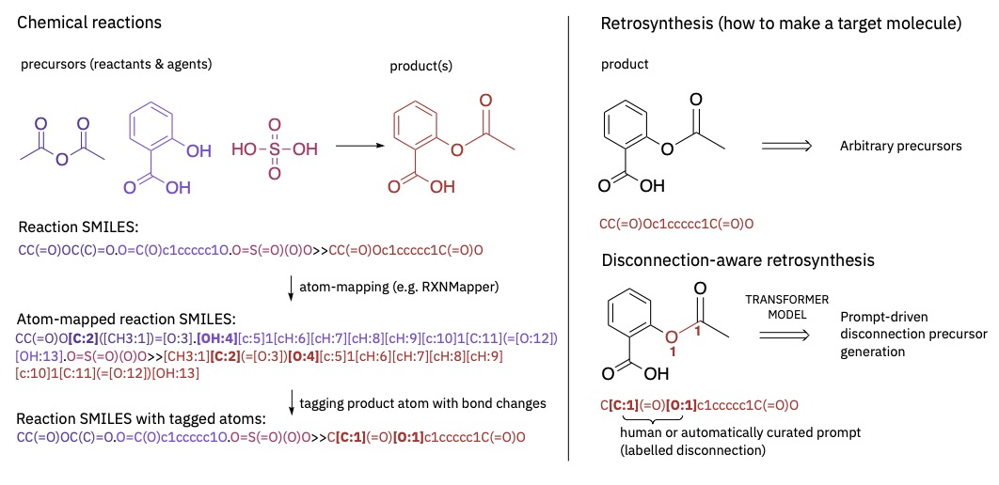

.. These are examples of badges you might want to add to your README:
   please update the URLs accordingly

    .. image:: https://api.cirrus-ci.com/github/<USER>/disconnection_aware_retrosynthesis.svg?branch=main
        :alt: Built Status
        :target: https://cirrus-ci.com/github/<USER>/disconnection_aware_retrosynthesis
    .. image:: https://readthedocs.org/projects/disconnection_aware_retrosynthesis/badge/?version=latest
        :alt: ReadTheDocs
        :target: https://disconnection_aware_retrosynthesis.readthedocs.io/en/stable/
    .. image:: https://img.shields.io/coveralls/github/<USER>/disconnection_aware_retrosynthesis/main.svg
        :alt: Coveralls
        :target: https://coveralls.io/r/<USER>/disconnection_aware_retrosynthesis
    .. image:: https://img.shields.io/pypi/v/disconnection_aware_retrosynthesis.svg
        :alt: PyPI-Server
        :target: https://pypi.org/project/disconnection_aware_retrosynthesis/
    .. image:: https://img.shields.io/conda/vn/conda-forge/disconnection_aware_retrosynthesis.svg
        :alt: Conda-Forge
        :target: https://anaconda.org/conda-forge/disconnection_aware_retrosynthesis
    .. image:: https://pepy.tech/badge/disconnection_aware_retrosynthesis/month
        :alt: Monthly Downloads
        :target: https://pepy.tech/project/disconnection_aware_retrosynthesis
    .. image:: https://img.shields.io/twitter/url/http/shields.io.svg?style=social&label=Twitter
        :alt: Twitter
        :target: https://twitter.com/disconnection_aware_retrosynthesis

.. image:: https://img.shields.io/badge/-PyScaffold-005CA0?logo=pyscaffold
    :alt: Project generated with PyScaffold
    :target: https://pyscaffold.org/

|

==================================
Interactive Retrosynthetic Language Models
==================================

    This repository provides functionality for preprocessing data for, and training interactive retrosynthetic language models,
    so called disconnection aware retrosynthesis.

Abstract
########

Data-driven approaches to retrosynthesis have thus far been limited in user interaction, in the diversity of their predictions, 
and in the recommendation of unintuitive disconnection strategies. Herein, we extend the notions of prompt-based inference in 
natural language processing to the task of chemical language modelling. We show that by using a prompt describing the disconnection 
site in a molecule, we are able to steer the model to propose a wider sets of precursors, overcoming training data biases in 
retrosynthetic recommendations and achieving a 39 % performance improvement over the baseline. For the first time, the use of a 
disconnection prompt empowers chemists by giving them back greater control over the disconnection predictions, resulting in more 
diverse and creative recommendations. In addition, in lieu of a human-in-the-loop strategy, we propose a schema for automatic 
identification of disconnection sites, followed by prediction of reactant sets, achieving a 100 % improvement in class diversity 
as compared to the baseline. The approach is effective in mitigating prediction biases deriving from training data, providing a 
larger variety of usable building blocks which in turn improves the end-user digital experience. We demonstrate its application 
to different chemistry domains, from traditional to enzymatic reactions, in which substrate specificity is key. 

Dataset
#######

The data used was derived from the `US Patent Office extracts (USPTO) by Lowe <https://figshare.com/articles/dataset/Chemical_reactions_from_US_patents_1976-Sep2016_/5104873>`
and was processed to filter for the following conditions:

- min_reactants: 2
- max_reactants: 10
- max_reactants_tokens: 300
- min_agents: 0
- max_agents: 0
- max_agents_tokens: 0
- min_products: 1
- max_products: 1
- max_products_tokens: 200
- max_absolute_formal_charge: 2

The reactions were mapped with `RXNMapper <https://github.com/rxn4chemistry/rxnmapper>`

Refer to the data folder for an explanation of how to process an eample dataset.

Note: For using Enzyme data the model can be trained following the procedure of `Probst et. al. <https://github.com/rxn4chemistry/biocatalysis-model>` after tagging disconnection sites as shown below.

Installation and Usage
######
::

    git clone https://github.com/rxn4chemistry/disconnection_aware_retrosynthesis.git 
    cd disconnection_aware_retrosynthesis
    conda create -n disconnect python=3.7 -y
    conda activate disconnect
    pip install -e .

For the purposes preprocessing the data and tagging the disconnection site some utility functions are provided.

.. code-block:: python

    from disconnection_aware_retrosynthesis.tagging import get_tagged_products

    rxn = 'CC(C)(C)O[Cl:18].CCO.ClCCl.[CH3:1][CH2:2][O:3][C:4](=[O:5])[CH2:6][NH:7][c:8]1[cH:9][cH:11][c:12]([CH2:13][CH2:14][OH:15])[cH:16][cH:17]1.[ClH:10]>>[CH3:1][CH2:2][O:3][C:4](=[O:5])[CH2:6][NH:7][c:8]1[c:9]([Cl:10])[cH:11][c:12]([CH2:13][CH2:14][OH:15])[cH:16][c:17]1[Cl:18]'
    precursor, product = rxn.split('>>')
    tagged_product = get_tagged_products(precursor, product)
    print(tagged_product)
    >>> 'CCOC(=O)CNc1[c:1]([Cl:1])cc(CCO)c[c:1]1[Cl:1]'

Training the Disconnection Aware Retrosynthesis Model
#####################################################
Model training was conducted with OpenNMT-py

The first step is to run `onmt_preprocess`:

::

    DATA=data/
    DATASET=FullUSPTO

    onmt_preprocess \
    -train_src ${DATA}/${DATASET}.disconnection_aware.train.products_tokens \
    -train_tgt ${DATA}/${DATASET}.disconnection_aware.train.precursors_tokens \
    -valid_src ${DATA}/${DATASET}.disconnection_aware.validation.products_tokens \
    -valid_tgt ${DATA}/${DATASET}.disconnection_aware.validation.precursors_tokens \
    -save_data ${DATA}/${DATASET} \
    -src_seq_length 1000 -tgt_seq_length 1000 \
    -src_vocab_size 1000 -tgt_vocab_size 1000 -share_vocab

Once the OpenNMT pre-preprocessing has finished, the actual training can be started:

::

    DATA=data/
    SAVE_MODEL=disconnection_aware

    mkdir ${DATA}/logs
    onmt_train \
    -data ${DATA}/${SAVE_MODEL} \
    -save_model ${DATA}/${SAVE_MODEL} \
    -seed 42 \
    -gpu_ranks 0 \
    -save_checkpoint_steps 5000 \
    -keep_checkpoint 20 \
    -train_steps 260000 \
    -param_init 0 \
    -param_init_glorot \
    -max_generator_batches 32 \
    -batch_size 6144 \
    -batch_type tokens \
    -normalization tokens \
    -max_grad_norm 0 \
    -accum_count 4 \
    -optim adam \
    -adam_beta1 0.9 \
    -adam_beta2 0.998 \
    -decay_method noam \
    -warmup_steps 8000  \
    -learning_rate 2 \
    -label_smoothing 0.0 \
    -report_every 1000  \
    -valid_batch_size 8 \
    -layers 4 \
    -rnn_size 384 \
    -word_vec_size 384 \
    -encoder_type transformer \
    -decoder_type transformer \
    -dropout 0.1 \
    -position_encoding -share_embeddings -global_attention general \
    -global_attention_function softmax -self_attn_type scaled-dot \
    -heads 8 -transformer_ff 2048 \
    --tensorboard --tensorboard_log_dir ${DATA}/logs

Note: The above procedure can be followed to preprocess and train a model between any two sequences. 
For instance the AutoTag model can be trained by using the same approach.

Translation
***********

::

    DATA=data/
    MODEL=$(ls data/disconnection_aware*.pt -t | head -1)
    DATASET=FullUSPTO
    N_BEST=10

    onmt_translate \
    -model ${MODEL} \
    -src ${DATA}/${DATASET}.disconnection_aware.test.products_tokens \
    -output ${DATA}/retro_predictions_${MODEL}_top_${N_BEST}.txt \
    -batch_size 64 -replace_unk -max_length 200 \
    -gpu 0 -n_best ${N_BEST} -beam_size 10

Automatic Tagging of Disconnection Sites (AutoTag)
**************************************************

A model can be trained to automatically identify disconnection sites in a given molcule using the data provided and the training workflow shown above.
The data must first be pre-processed such that the following apply:
    - Source data: Tokenised product SMILES (no atom-mapping)
    - Target data: Tokenised tagged product SMILES

A notebook is given to outline the general workflow used to preprocess the given data.

Improving Class Diversity at Model Inference
*********************************************

Class diversity of single-step retrosynthesis can be improved by calling the 'AutoTag' model first to identify potential disconnection sites.
The number of disconnection sites identified can be tuned with the `-n_best` parameter. We recommend setting the `-n_best` parameter to 10.

For each prediction the Disconnection Aware model can be used to predict one set of precursors.

The following calls to translate are an example:

::

    DATA=data/
    AUTOTAG_MODEL=$(ls data/autotag*.pt -t | head -1)
    DATASET=FullUSPTO
    N_BEST=10

    onmt_translate \
    -model ${AUTOTAG_MODEL} \
    -src ${DATA}/${DATASET}.disconnection_aware.test.products_tokens \
    -output ${DATA}/autotagged_output.txt \
    -batch_size 64 -replace_unk -max_length 200 \
    -gpu 0 -n_best ${N_BEST} -beam_size 10

We suggest canonicalising the output from the AutoTag model prior to subsequent translation for optimal performance.

::

    DATA=data/
    DISCONNECTION_MODEL=$(ls data/disconnection_aware*.pt -t | head -1)
    DATASET=FullUSPTO
    N_BEST=1

    onmt_translate \
    -model ${DISCONNECTION_MODEL} \
    -src ${DATA}/autotagged_output.txt \
    -output ${DATA}/diverse_output.txt \
    -batch_size 64 -replace_unk -max_length 200 \
    -gpu 0 -n_best ${N_BEST} -beam_size 10
